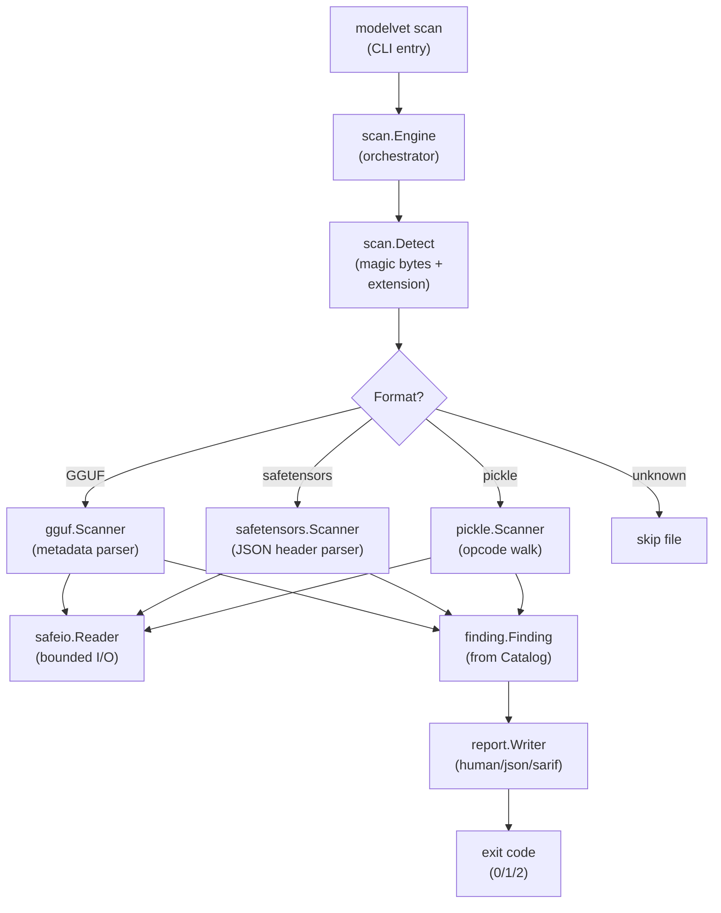
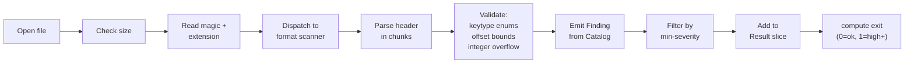

# modelvet

[](https://github.com/t3bik/modelvet/actions/workflows/ci.yml)
[](LICENSE)


A static security scanner for machine-learning model artifacts. Inspects GGUF, safetensors, and Python pickle/PyTorch models for supply-chain and malicious-artifact risks **without ever loading, unpickling, or executing the model**.

## Why it matters

Model files are code execution vectors. A compromised `.gguf`, `.safetensors`, or `.pt` file can exploit memory-safety bugs in model loaders, deliver backdoors via pickle RCE gadgets, or exhaust resources through integer-overflow or zip-bomb attacks. `modelvet` detects these risks **before** the file reaches a loader.

Unlike model-introspection tools that load and inspect weights, `modelvet` reads only file metadata and structure using static analysis. The attack surface is bounded: no Python runtime, no model unpickling, no external dependencies.

## Features

- **Formats**: GGUF (llama.cpp), safetensors (HuggingFace), Python pickle + PyTorch `.pt` zip container.
- **Detection classes**:
  - Type-confusion bugs (bad enum codes, size/shape mismatches).
  - Integer-overflow paths (dimension product overflow, offset overflow).
  - Memory-safety breaks (out-of-bounds read offsets, overlapping tensor regions).
  - RCE gadgets (pickle GLOBAL + REDUCE, dangerous module references).
  - Zip-bomb signals (entry-count caps, compression-ratio checks).
- **Output formats**: human-readable (default), JSON, SARIF (GitHub code scanning).
- **CI-friendly**: non-zero exit code on High/Critical findings; `--min-severity` filtering; `--quiet` mode.
- **Safe by design**: bounded allocations, overflow-safe arithmetic, no panics on hostile input, fuzzed.

## Install

### Homebrew (macOS, Linux)
```bash
brew install t3bik/tap/modelvet
```

### go install
```bash
go install github.com/t3bik/modelvet/cmd/modelvet@latest
```

### Docker
```bash
docker run --rm -v "$PWD:/data" t3bik/modelvet scan /data/model.gguf
```

### From release
Download a pre-built binary for your platform (Linux/macOS, x86-64/ARM64) from [GitHub Releases](https://github.com/t3bik/modelvet/releases). Verify against `checksums.txt`:
```bash
sha256sum -c checksums.txt
```

## Quickstart

**Scan a single file:**
```bash
modelvet scan model.gguf
```

**Scan a directory recursively:**
```bash
modelvet scan --recurse ./models/
```

**Output as JSON:**
```bash
modelvet scan --format json model.pt | jq '.findings[].rule_id'
```

**Report only Critical findings:**
```bash
modelvet scan --min-severity critical ./models/
```

**Use in CI/CD (fail if High/Critical found):**
```bash
modelvet scan ./models/
if [ $? -eq 1 ]; then
  echo "Security findings detected" >&2
  exit 1
fi
```

### Example output

**Benign file (human format):**
```
--- Summary ---
Scanned: 1  Skipped: 0  Findings: 0
```

**Malicious file (human format):**
```
=== model_malicious.pkl ===
[CRITICAL] PKL-GLOBAL-001  offset=n/a
  GLOBAL opcode references os module (code-execution risk)
  Remediation: The pickle references a dangerous module (os, subprocess, builtins, etc.). Unpickling this file may execute arbitrary code. Reject immediately.

[HIGH] PKL-REDUCE-001  offset=n/a
  REDUCE opcode present alongside GLOBAL reference
  Remediation: REDUCE + GLOBAL is the standard RCE gadget shape in malicious pickles. Combined with a dangerous GLOBAL, this is a Critical-risk artifact.

--- Summary ---
Scanned: 1  Skipped: 0  Findings: 2
  CRITICAL: 1  HIGH: 1  MEDIUM: 0  LOW: 0  INFO: 0
```

**Same file (JSON format):**
```json
{
  "findings": [
    {
      "rule_id": "PKL-GLOBAL-001",
      "severity": "CRITICAL",
      "format": "pickle",
      "path": "model_malicious.pkl",
      "offset": -1,
      "detail": "GLOBAL opcode references os module (code-execution risk)",
      "remediation": "The pickle references a dangerous module (os, subprocess, builtins, etc.). Unpickling this file may execute arbitrary code. Reject immediately."
    },
    {
      "rule_id": "PKL-REDUCE-001",
      "severity": "HIGH",
      "format": "pickle",
      "path": "model_malicious.pkl",
      "offset": -1,
      "detail": "REDUCE opcode present alongside GLOBAL reference",
      "remediation": "REDUCE + GLOBAL is the standard RCE gadget shape in malicious pickles. Combined with a dangerous GLOBAL, this is a Critical-risk artifact."
    }
  ],
  "summary": {
    "scanned": 1,
    "skipped": 0,
    "findings": 2
  }
}
```

## How it works

### Architecture

The scanner orchestrates format detection and dispatch through three independent format parsers, each producing findings without loading the model.



### Scan pipeline

The parse path follows a uniform pattern: detect format → bounded read → find violations → report.



### Parser safety

Each format parser uses **`safeio.Reader`** — a bounded I/O wrapper that enforces:
- **Allocation cap**: never allocates more than a fixed limit (e.g. 256 MiB).
- **Bounds check**: every read is validated against file size using **overflow-safe arithmetic** (`n > size-off`, not `off+n`).
- **No unbounded reads**: every `.ReadAt()` or `.Bytes()` call specifies exact offsets and lengths.

This defense applies uniformly across all three format parsers.

#### Pickle static analysis (no unpickling)

The pickle scanner walks the opcode stream byte-by-byte, reading each opcode's inline arguments without ever invoking `pickle.loads()` or building a Python object graph. It records:
- Module references via `GLOBAL` / `STACK_GLOBAL`.
- Presence of reduction opcodes (`REDUCE`, `INST`, `OBJ`).
- Stops on unrecognized opcodes.

Dangerous modules (`os`, `subprocess`, `builtins`, etc.) trigger `PKL-GLOBAL-001` (Critical). Watch-listed modules (`shutil`, `pickle`, etc.) trigger `PKL-GLOBAL-002` (High).

#### GGUF type-confusion detection

GGUF metadata values have a `value_type` code (0–12). A code outside this range is `GGUF-KV-TYPE-001` (Critical) — an integer that, if trusted by a parser, will cause a type-confused read (the origin of this tool).

#### Offset-overflow detection

Tensor offsets and data ranges are checked for:
- Out-of-bounds: `offset + computed_size > file_size` → Critical.
- Overlap: two tensors sharing byte ranges → Medium.
- Negative or reversed ranges.

All arithmetic uses overflow-safe checks.

### Output formats

#### Human (default)
Findings grouped by file, sorted by severity descending, tagged with rule ID and byte offset.

#### JSON
Structured output for tooling. Parses cleanly with `jq` for filtering and scripting.

#### SARIF 2.1.0
GitHub-aware format for [GitHub code scanning](https://docs.github.com/en/code-security/code-scanning/integrating-with-code-scanning/about-code-scanning). Emits:
- `rules`: the rule catalog.
- `results`: array of findings with severity, location, and message.
- `locations`: byte-offset regions in the artifact.

Plug `modelvet` output directly into `github/codeql-action/upload-sarif@v2`.

## Security & safety posture

- **Never loads models.** No `torch.load()`, no model unpickling, no Python runtime.
- **Hostile-input resilient.** Designed to handle malformed, truncated, or deliberately adversarial files without panic, OOM, or unbounded blocking.
- **Fuzzed.** Native Go fuzz tests prove the three parsers return in bounded memory/time on arbitrary input.
- **Zero runtime dependencies.** Everything is the Go standard library; `go build -a` produces a static binary.
- **Reversible parsers.** All parsing is read-only byte inspection; no side-effects, no globals mutated.

## Flags & exit codes

```
modelvet scan [flags] <path-or-dir> [more paths...]

Flags:
  -format string
        output format: human|json|sarif (default "human")
  -min-severity string
        minimum severity to report: info|low|medium|high|critical (default "info")
  -recurse
        recurse into directories (default true)
  -quiet
        suppress per-file "OK" lines (findings always printed)

Exit codes:
  0  success; no High or Critical findings among reported findings
  1  success; at least one High or Critical finding reported
  2  usage or I/O error (bad flag, unreadable path, etc.)
```

## Development

### Build
```bash
go build ./...
```

### Test (with race detection)
```bash
go test ./... -race -cover
```

### Full gate (as CI runs it)
```bash
go build ./...
go vet ./...
go test ./... -race -cover
gosec -quiet ./...
govulncheck ./...
```

### Fuzz (optional; runs for 10 seconds)
```bash
go test -fuzz=FuzzScanGGUF ./internal/gguf -fuzztime=10s
go test -fuzz=FuzzScanSafetensors ./internal/safetensors -fuzztime=10s
go test -fuzz=FuzzScanPickle ./internal/pickle -fuzztime=10s
```

## License

MIT — [Copyright (c) 2026 Tuba Ünsal](LICENSE)
